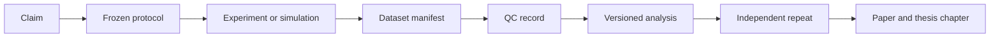

---
{"dg-publish":true,"permalink":"/i-projects/03-milestones/20260925-minimum/doctoral-progress-review-and-research-plan-for-professional-discussion-2026/","title":"Doctoral Progress Review and Research Plan for Professional Discussion 2026","noteIcon":"","created":"2026-09-10","updated":"2026-09-10","dg-note-properties":{"title":"Doctoral Progress Review and Research Plan for Professional Discussion 2026","aliases":["Professional Discussion Reviewer Dossier 2026","Two-Year Doctoral Progress Report 2026"],"project_id":"MIN-2026-REVIEW","type":"milestone","status":"draft-for-supervisor-review","context":"thesis","priority":"critical","date":"2026-09-10","last_updated":"2026-09-10","candidate":"Ing. Michal Sakala","supervisor":"doc. Ing. Jan Mikeš, Ph.D.","supervising_department":"Department of Economics, Management and Humanities (K13116), CTU FEE","study_start":"2024-09-01","milestone":"Dissertation progress report and professional discussion"}}
---

# Doctoral Progress Review and Research Plan for Professional Discussion 2026

**Candidate:** Ing. Michal Sakala  
**Supervisor:** doc. Ing. Jan Mikeš, Ph.D.  
**Supervising department:** Department of Economics, Management and Humanities (K13116), Faculty of Electrical Engineering, Czech Technical University in Prague  
**Experimental collaboration:** HiLASE Centre, Institute of Physics of the Czech Academy of Sciences  
**Study start recorded in the application:** 1 September 2024  
**Milestone:** dissertation progress report and professional discussion after two years of doctoral study  
**Document status:** complete review draft; formal course records, individual deadlines, apparatus availability and the final title remain subject to the confirmations listed in Section 2.5

> [!abstract] Purpose of this document
> This dossier gives an opponent and the professional-discussion board one coherent basis for assessing (i) progress during the first two years, (ii) compliance with the doctoral-study framework, (iii) the quality and feasibility of the proposed dissertation, (iv) the evidence already produced, and (v) the work required to reach the State Doctoral Examination and dissertation defence. It deliberately distinguishes verified outputs from working records and future claims.

> [!warning] Evidence convention
> **Verified** means that an inspectable primary record is available in the workspace or an official institutional source confirms it. **Working record** means that the activity is recorded in the doctoral vault but has not been reconciled with KOS or an official decision. **Proposed** means that the board or supervisor has not yet approved the item. **Conditional** means that the work is activated only after a stated gate. No planned numerical performance is presented as an achieved result.

## 1. Executive review

The first two study years established a coherent research direction in laser-assisted high-voltage breakdown and produced two traceable conference outputs. The 2024 ICOLSE proceedings contain *Analysis of Laser Parameters for Efficient Quantum Ionization in Air for HV Circuit Triggering*. The 2025 Asia-Pacific International Conference on Lightning proceedings contain *The Dynamics of Laser-Driven Ionisation in High-Voltage Circuit Switching*, DOI [10.1109/APL65034.2025.11108944](https://doi.org/10.1109/APL65034.2025.11108944), with Michal Sakala listed first. The latter paper reports experiments performed at HiLASE with picosecond PERLA pulses and a 40 kV spherical air-gap apparatus. It provides a useful feasibility baseline: laser irradiation changed the measured breakdown voltage and the recorded electrical delay depended on voltage and irradiance.

The existing work is sufficient to motivate a dissertation, but it is not yet sufficient to support strong claims about sub-nanosecond switching, long-term reliability, grid protection or economic benefit. The published experiment used at least five repetitions per configuration, measured delay from an electrical laser-trigger edge rather than a calibrated optical arrival marker, and did not establish a full shot-level uncertainty and censoring framework. These limitations define the doctoral contribution rather than weaken it: the dissertation should progress from a parameter demonstration to a reproducible, metrologically traceable and predictive study.

The recommended core topic is:

> **Laser-Controlled Breakdown in Atmospheric-Pressure High-Voltage Gaps: Plasma-Channel Diagnostics, Stochastic Switching Dynamics, and Predictive Modelling**

The core asks how the measured, time-dependent state of a laser-created channel changes breakdown probability, delay and jitter at a controlled electric working point, and whether a reduced physical model can predict those outcomes under conditions excluded from model calibration. It is designed to remain defensible if optional EMP, radiation, beam-shaping, SF6-replacement or techno-economic work does not mature in time.

The immediate administrative risk is evidence completeness. The vault does not contain a signed KOS export proving the exact completed course set, results, English-language disposition or individual study-unit closure. The APL paper is verifiably published, but its formal recognition as the lead-author article required for the study unit must be confirmed in KOS or by the Branch Board/Office for Science and Research. These are documentation actions, not scientific deficiencies, and should be closed before the board meeting.

### 1.1 Recommendation to the board

The board is invited to:

1. accept the progress report subject to reconciliation of the administrative evidence listed in Section 2.5;
2. approve or revise the proposed title and the three core contribution areas C-A to C-C;
3. confirm that the core scope is atmospheric-pressure breakdown, synchronized diagnostics, stochastic analysis and reduced predictive modelling;
4. treat application economics and the technology extensions as bounded or conditional work;
5. record an explicit route to the State Doctoral Examination by the end of the third study year;
6. require a metrology and safety gate before the next experimental campaign.

## 2. Doctoral-study framework and compliance position

### 2.1 Applicable regulatory baseline

The candidate began study after the current Faculty Doctoral Study Code entered into force. The primary planning baseline is therefore the [Doctoral Study Code for CTU FEE approved in December 2023](https://intranet.fel.cvut.cz/en/education/rules/DoctoralStudyCode_FEE-2023.pdf). The [FEE regulations page](https://intranet.fel.cvut.cz/en/education/rules) lists the related Dean's directives.

Under Articles 5–10 of the 2023 Code, the key obligations are:

- the study unit consists of doctoral courses, a dissertation progress report with a successful debate, and scientific activity evidenced by at least one accepted related scientific article for which the doctoral student is lead author;
- the ISP contains at least two doctoral courses, or courses with a combined workload of at least 100 hours, approved by the supervisor;
- at least one ISP course must be passed in the first study year;
- in a full-time programme, the study unit must normally be completed by the end of the 25th month;
- the State Doctoral Examination must be taken by the end of the third study year in full-time study;
- before dissertation submission, at least three related scientific articles must be published or accepted, the student must be lead author of at least two, and at least one lead-author article must satisfy the journal or conference quality category stated in Article 7;
- each scientific article requires a statement of the authors' contributions unless the article already includes it;
- internationalisation normally requires a Branch-Board-approved foreign internship of at least one month and must be complete before the defence application; a replacement requires the exceptional procedure stated in Article 8;
- dissertation submission requires completion of the study unit, the State Doctoral Examination, the publication obligations and internationalisation.

The 2017 [Dean's Directive for Conducting Professional Debates](https://intranet.fel.cvut.cz/en/education/rules/SD_debate.pdf) remains useful for the expected content and conduct: the written study summarises the state of the art and the student's own results; the debate addresses the proposed dissertation title and content; at least one external opponent is appointed; reviews should be made available to the student; and the board accepts the report, requests revision, or rejects it. Its older credit-based eligibility language predates the candidate's regime and must not replace the 2023 Code without written faculty confirmation.

### 2.2 Milestone purpose

The professional discussion is not a ceremonial presentation. It is the point at which the board tests whether:

- the research problem is scientifically relevant and sufficiently narrow;
- the prior work supports a plausible doctoral trajectory;
- the proposed methods can distinguish the competing physical explanations;
- the required equipment, expertise, time and access are realistic;
- the intended contribution is original, measurable and falsifiable;
- the remaining programme obligations can be completed within the study period.

The written study should therefore combine a critical literature and prior-results synthesis with an executable forward plan. A broad catalogue of attractive applications cannot substitute for a testable core question.

### 2.3 Compliance matrix as of 10 September 2026

| Requirement | Evidence currently available | Assessment | Required closure |
| --- | --- | --- | --- |
| Study start and cohort | Filled professional-discussion application records 1 September 2024 | Verified from local form | Confirm KOS regime and study form in the signed export |
| ISP approved | Narrative ISP record exists | Working record | Attach current approved ISP or KOS printout |
| At least two doctoral courses / 100 hours | No signed KOS course list in the vault | Not evidenced | Insert course codes, official titles, workload and results from KOS |
| At least one ISP course passed in year 1 | Home page contains a claim, but the dedicated tracker has no evidence | Not evidenced | Reconcile with KOS; remove or correct conflicting dashboard text |
| Dissertation progress report | This dossier and the linked research package | Prepared | Supervisor review, opponent version and formal submission |
| Successful professional discussion | Event is being prepared | Pending | Record invitation, board, reviews, minutes and resolution |
| Accepted related article with lead authorship | APL 2025 proceedings article, first-listed author, DOI and CTU record | Publication verified; formal milestone recognition unconfirmed | Obtain Branch Board/OSR/KOS confirmation that it satisfies Article 5(1)(c) |
| English-language obligation | The 2023 Code does not state a separate universal English exam; older debate directive describes an optional route | Individual status unclear | Confirm the applicable ISP/KOS requirement and evidence |
| State Doctoral Examination | Internal target June 2027 | Planned | Confirm eligibility, topics, application deadline and examination term |
| Three related scientific articles by dissertation submission | ICOLSE 2024 and APL 2025 exist; exact category/count recognition not confirmed | Partially evidenced | Build publication plan with acceptance lead time and formal classification |
| At least two lead-author articles | APL 2025 lists candidate first; ICOLSE listing exists | Formal lead-author count unconfirmed | Add contribution statements and Branch Board determination if needed |
| One qualifying Q1–Q3/MathSciNet/CORE A*/A lead-author article | No qualifying evidence identified in the reviewed record | Outstanding | Submit a journal-quality core result early enough for peer review |
| Internationalisation | No completed-stay evidence identified | Outstanding | Select host, secure prior Branch Board approval and schedule the stay |
| Semester evaluations | Mentioned as an ongoing obligation, but signed records not inspected | Not evidenced here | Attach or link KOS/OSR records for the first four semesters |

### 2.4 Deadline interpretation

For a continuous full-time study beginning on 1 September 2024, the 25th-month study-unit deadline falls in the period ending 30 September 2026. The exact administrative calculation, any interruption and the formal discussion date must be confirmed by the faculty. The full-time State Doctoral Examination deadline falls at the end of the third study year, nominally 31 August 2027. June 2027 is therefore a prudent internal examination target, leaving a limited contingency before the statutory study-year boundary.

The internal dissertation submission target remains August 2028. It is a planning target rather than an asserted binding deadline or defence date. Publication review cycles and internationalisation must be scheduled well before it.

### 2.5 Evidence package required before submission of this report

- [ ] Signed KOS list of completed compulsory courses, including codes, results and workload.
- [ ] Current approved ISP and any approved amendments.
- [ ] Semester evaluations for 2024/2025 and 2025/2026.
- [ ] Written confirmation of the APL 2025 article's recognition under Article 5.
- [ ] Written clarification of any individual English-language requirement.
- [ ] Confirmed professional-discussion date, submission route, required number of copies and presentation time.
- [ ] Professional-discussion application accepted by the competent body.
- [ ] APL 2025 bibliographic record and full text; ICOLSE 2024 programme/proceedings evidence.
- [ ] Supervisor statement and opponent review when available.
- [ ] Current foreign-stay status and Branch Board approval route.

## 3. Progress during the first two study years

### 3.1 Baseline at entry — September 2024

The doctoral work builds on the candidate's earlier experimental study of laser-assisted breakdown in a spherical atmospheric-air spark gap. This starting point established practical experience with high voltage, laser alignment, waveform acquisition and the effect of optical parameters on breakdown. It also exposed a methodological gap: a demonstration of voltage reduction at selected settings does not by itself establish a reproducible switching operating window, a causal channel-state mechanism or a transferable predictive model.

The doctoral direction was therefore progressively reframed from “laser parameters affect breakdown” toward “measured channel state and controlled electric conditions determine stochastic switching outcomes.” This is an appropriate increase in depth from a master's-level parameter study to doctoral research.

### 3.2 Academic year 2024/2025

The working ISP record attributes the following activities to the first year:

- theoretical coursework and literature review;
- initial work on laser-triggered breakdown;
- presentation/publication activity at ICOLSE 2024;
- preparation of the APL 2025 paper.

The ICOLSE 2024 proceedings and conference programme list the paper *Analysis of Laser Parameters for Efficient Quantum Ionization in Air for HV Circuit Triggering*. This is a verified dissemination output and demonstrates continuity from the earlier experimental work. Its exact role in the doctoral publication requirement remains for the programme authorities to classify.

Course completion cannot be responsibly reconstructed from narrative notes. The dashboard statement referring to completed Plasma Theory, Laser Physics and Academic English examinations is not used as evidence in this report because no matching signed KOS record was inspected.

### 3.3 Academic year 2025/2026

The central verified output is the APL 2025 conference paper:

> M. Sakala, J. Mikeš, O. Hanuš, M. Efmertová and M. Mydlář, “The Dynamics of Laser-Driven Ionisation in High-Voltage Circuit Switching,” *Proceedings of the 13th Asia-Pacific International Conference on Lightning*, pp. 423–428, 2025. DOI: [10.1109/APL65034.2025.11108944](https://doi.org/10.1109/APL65034.2025.11108944).

The CTU FEE publication register identifies the department and proceedings record. The local full text documents the apparatus, ten measurement series and the reported results. During this period the doctoral work also moved toward:

- a more rigorous definition of breakdown probability, delay, jitter and failed shots;
- separation of laser settings from measured pulse and channel properties;
- a traceable claim ledger and evidence chain;
- reduced modelling and held-out validation;
- preparation of the professional discussion and dissertation scope decision.

These methodological developments are recorded as plans and protocols. They must not be confused with a completed high-statistics campaign.

### 3.4 Outputs and assets available at the two-year milestone

| Asset | Status | Value for the dissertation | Limitation |
| --- | --- | --- | --- |
| ICOLSE 2024 conference paper | Proceedings/programme verified | Establishes the initial parameter-analysis line | Full bibliographic/indexing and contribution evidence should be archived |
| APL 2025 conference paper | Published; DOI and full text verified | Apparatus baseline, voltage-reduction and delay observations | Small repetitions, incomplete uncertainty chain, electrical trigger reference |
| Existing apparatus experience | Demonstrated in the papers | Reduces setup risk and supports feasibility | Current configuration and availability are not yet certified for the next campaign |
| Research question and claim ledger | Developed in the vault | Converts broad ambitions into testable contributions | Requires formal supervisor/board approval |
| WP0–WP5 research package | Detailed plan available | Specifies metrology, statistics, experiments and modelling | Dates depend on laboratory access and study-unit closure |
| Publication and dissertation architecture | Developed | Connects claims to papers and chapters | Target venues and acceptance timing remain uncertain |

### 3.5 Critical assessment of progress

**Strengths**

- The topic is continuous with experimental work already performed.
- Two conference outputs provide evidence of dissemination and a technical starting point.
- The apparatus has produced measurable laser-induced changes in breakdown behaviour.
- The present research architecture contains explicit acceptance, falsification, uncertainty and fallback logic.
- HiLASE collaboration provides access to a specialised ultrafast laser environment.

**Weaknesses to correct immediately**

- The course and administrative record is not assembled in one auditable package.
- The present apparatus configuration, named owners, access dates and calibration state are not formally frozen.
- Prior timing data use an electrical trigger marker and cannot support optical time-zero claims without calibration.
- Five or similarly small repetitions per configuration do not support strong reliability or distribution claims.
- Earlier drafts overextended the result toward grid protection, SF6 replacement and economic savings without a system demonstrator.
- The qualifying journal-publication route must start early enough to accommodate peer review.

## 4. Prior scientific work and what it establishes

### 4.1 APL 2025 experimental apparatus

The local paper reports:

- two stainless-steel spherical electrodes, each 20 mm in diameter;
- atmospheric-air gaps of 5 mm and 10 mm;
- a Technix SR 40 kV–5 kW DC high-voltage source;
- a picosecond thin-disk PERLA laser platform;
- tested wavelengths of 1030 nm, 515 nm and 257.5 nm;
- reported pulse width of 1.2 ps, repetition rate of 1 kHz, beam diameter of 30 µm and average power up to 10.69 W;
- a laser beam directed through the gap without intended electrode contact;
- a Tektronix MDO4054B oscilloscope, Tektronix P6015A high-voltage probe and Pearson 1423 current monitor;
- seven breakdown-voltage series and three electrical-delay series;
- at least five repetitions per configuration.

These values describe the published campaign. They do not certify which laser branch, source configuration or diagnostics are currently available in 2026. The next campaign requires a dated configuration record rather than copying nominal values from the paper.

### 4.2 Reported results

The paper reports maximum breakdown-voltage reductions between approximately 18% and 31% across the tested series. Its largest tabulated relative reduction is 31% for the 515 nm, 10 mm configuration. Recorded delay values range from approximately 0.164 µs to 8.124 µs across the reported electrical conditions. Lower applied voltage generally corresponds to longer measured delay, and the data suggest an irradiance dependence.

These results establish **feasibility and a trend within the reported setup**. They do not yet establish:

- an uncertainty-qualified $U_{50}$ operating curve;
- day-to-day reproducibility;
- a sub-nanosecond delay or jitter capability;
- separation of statistical and formative delay;
- a measured electron-density or gas-density channel state;
- transfer to a high-current circuit breaker;
- electrode-life improvement or total-cost benefit.

### 4.3 Measurement limitations that define the next contribution

The reported delay begins at the falling edge of an electrical laser-trigger signal. The physical quantity of interest begins at optical pulse arrival in the gap. Cable delays, laser internal timing, sensor response, oscilloscope channels and breakdown-marker algorithms therefore enter the reported value. The next study must define

$$
t_{\mathrm{reported}}=t_{\mathrm{physical}}+t_{\mathrm{sensor}}+t_{\mathrm{cable}}+t_{\mathrm{scope}}+t_{\mathrm{algorithm}}
$$

and estimate or bound each term.

The earlier repetition count is adequate for demonstrating that an effect may exist, but not for estimating rare misfires or stable jitter tails. Future sample sizes must be based on desired confidence or power after a pilot, must count all attempted shots, and must retain failed or censored outcomes.

## 5. Proposed dissertation definition

### 5.1 Recommended title

**Laser-Controlled Breakdown in Atmospheric-Pressure High-Voltage Gaps: Plasma-Channel Diagnostics, Stochastic Switching Dynamics, and Predictive Modelling**

The title is intentionally bounded. It promises a physical and statistical description of breakdown in a defined apparatus, not a deployable grid breaker. A Czech translation and the exact KOS wording should be approved and recorded separately.

### 5.2 Central research question

> How does the measured time-dependent state of a laser-induced channel, rather than nominal pulse energy alone, determine breakdown probability, delay and jitter in an atmospheric-pressure high-voltage gap at a controlled working coefficient, and can a reduced model predict these outcomes under held-out conditions?

### 5.3 Research questions

**RQ1 — Reproducible operating window.** At which normalised voltage, measured laser dose, focus condition and delay does laser exposure change breakdown probability and the distribution of breakdown time relative to matched controls?

**RQ2 — Channel-state mechanism.** Which measured optical or geometric channel descriptors improve explanation and prediction beyond nominal pulse energy, wavelength and applied voltage?

**RQ3 — Predictive model.** Can a reduced electron-balance and density-channel model predict at least one untouched observable—such as success probability or median censored delay—within a predeclared uncertainty or prediction tolerance?

**RQ4 — Robustness and transfer.** Which effects remain after accounting for day, atmosphere, electrode conditioning, polarity and geometry, and where does the model fail?

### 5.4 Hypotheses and falsification routes

| ID | Testable hypothesis | Primary evidence | Falsification or bounded outcome |
| --- | --- | --- | --- |
| H1 | Laser exposure changes breakdown probability at matched $k=U_{app}/U_{50}$ | Randomised laser-on/off shots with binomial intervals | No practically relevant change within a stated confidence bound |
| H2 | Delay and jitter depend jointly on $k$ and measured channel state | Censored delay distributions and mixed/survival models | Effects are below measurement resolution or not reproducible |
| H3 | Measured channel descriptors improve held-out prediction over nominal energy alone | Predeclared comparison of out-of-sample calibration and scoring | No meaningful predictive gain; energy-only model retained as bound |
| H4 | A reduced physical model transfers to untouched operating conditions | Calibration/validation split with prediction intervals | Failure regions are mapped and mechanism claims narrowed |
| H5 | A principal result persists across an independent day/electrode block | Independent repeat with frozen analysis | Result is declared session-specific and transfer limits are reported |

### 5.5 Intended original contributions

**C-A — Reproducible stochastic operating window.** A traceable map of laser-assisted breakdown probability, censored delay and jitter relative to an independently measured self-breakdown baseline.

**C-B — Channel-state-conditioned explanation.** A quantitative test of whether measured channel continuity, geometry or time evolution carries predictive information not contained in nominal laser settings.

**C-C — Reduced predictive model.** A reproducible, uncertainty-aware model evaluated on held-out experimental conditions, including explicit failure regions.

**Supporting contribution — robustness.** An interaction estimate or quantitative bound for polarity, geometry or conditioning, activated only if the core design has adequate statistical power.

The dissertation remains scientifically valid if a positive hypothesis is falsified, provided the experiment sets a useful quantitative bound and the negative result is independently checked.

## 6. Experimental system and required technical resources

### 6.1 Confirmed historical system versus required 2026 system

| Subsystem | Historical evidence from APL 2025 | Requirement for the doctoral campaign | Status on 10 Sep 2026 |
| --- | --- | --- | --- |
| Laser | PERLA platform; 1030/515/257.5 nm; 1.2 ps reported | Named branch/system ID, measured wavelength, pulse duration, delivered energy, profile and operating mode | Availability/configuration unconfirmed |
| Gap | 20 mm stainless-steel spheres; 5/10 mm gaps | One frozen reference geometry, controlled polarity, conditioning log and spare electrodes | To freeze |
| HV source | Technix SR 40 kV–5 kW DC | Approved circuit, actual waveform, stored energy, return path and safe repetition rate | To certify |
| Voltage | Tektronix P6015A | Instrument ID, calibration, transfer response, loading and uncertainty | To verify |
| Current | Pearson 1423 | Instrument ID, sensitivity, bandwidth, integration/droop and saturation checks | To verify |
| Acquisition | Tektronix MDO4054B | Common time base, sample rate, bandwidth, trigger path and channel delay calibration | To verify or upgrade |
| Optical timing | Electrical trigger edge used | Fast photodiode sampling the optical pulse or a calibrated surrogate | Required |
| Pulse energy | Average/setting-based values reported | Traceable shot-level or justified block-level pulse-energy measurement | Required |
| Beam/channel state | Beam directed through gap | Beam profile/waist and synchronized channel-emission or imaging descriptor | Required |
| Environment | Atmospheric air | Pressure, temperature and relative humidity per run/block | Required |
| Data integrity | Paper tables and waveforms | Unique shot ID, immutable raw data, metadata manifest, QC and analysis version | Required |

### 6.2 Minimum diagnostic stack

The mandatory measurement chain comprises:

1. fast optical timing marker;
2. calibrated high-voltage measurement;
3. current monitor compatible with the expected rise time and peak current;
4. oscilloscope channels on a common clock with documented bandwidth and offsets;
5. pulse-energy meter and beam-profile or knife-edge measurement at a safe surrogate plane;
6. synchronized optical-emission detector or camera;
7. environmental logger;
8. apparatus photographs, electrode-condition record and complete circuit diagram;
9. acquisition software or procedure generating a unique shot identifier.

An ICCD/gated camera, spectrometer, second voltage/current path, schlieren/shadowgraphy and calibrated RF diagnostics are preferred extensions. They become core only if their availability and calibration are confirmed before protocol freeze.

### 6.3 Safety and authorisation gate

No experiment begins solely on the authority of this document. WP0 requires the laboratory's approved laser and high-voltage risk assessments, responsible persons, access permissions, interlocks, exclusion zones, emergency procedure and a circuit review. Instrument ratings and protective measures must come from the approved local procedure. The public research note intentionally does not invent safety ratings.

### 6.4 Software and modelling resources

- Python or MATLAB for data ingestion, uncertainty propagation, generalized linear mixed models, survival analysis, bootstrap intervals and reproducible figures;
- version-controlled scripts and environment specification;
- a 0D/1D electron-balance and reduced gas-density model;
- COMSOL only where a defined observable and validation route justify the added complexity;
- a structured dataset manifest linking raw waveform files, apparatus state, calibration and claim IDs;
- independent storage and backup consistent with laboratory and institutional data rules.

## 7. Scientific methodology

### 7.1 Operational definitions

| Quantity | Definition for this project |
| --- | --- |
| $U_{50}$ | Voltage at 50% self-breakdown probability for a specified geometry, polarity, atmosphere and electrode-conditioning state |
| $k$ | $U_{app}/U_{50}$ determined for the relevant run block |
| Trigger success | Main discharge occurs within a predeclared time gate after the calibrated laser marker |
| Delay $t_d$ | Time between the defined optical laser marker and a defined electrical breakdown marker |
| Jitter | Distributional spread reported with a declared estimator, robust alternative and confidence interval |
| Misfire | Commanded valid acquisition without breakdown inside the gate; retained as a censored outcome |
| Laser intensity | Derived from measured pulse energy, duration and focal profile with propagated uncertainty |
| Channel state | Measured geometry, continuity, emission or density proxy at a defined delay |

### 7.2 Work packages

#### WP0 — Safety, metrology and frozen protocol

- produce the approved circuit and risk documentation;
- calibrate the timing chain and estimate channel offsets;
- run a four-state noise matrix: laser/HV off, laser only, sub-breakdown HV only, and both armed without a commanded discharge;
- define outcome markers, censoring, exclusion and stopping rules before the confirmatory data are inspected;
- freeze file naming, shot metadata, calibration and analysis versioning.

**Exit gate G0:** a dry run yields time-aligned, reconstructable data with known polarity and an uncertainty statement for each essential channel.

#### WP1 — Self-breakdown baseline

- condition electrodes under a documented procedure;
- estimate $U_{50}$ for the reference geometry and polarity using a justified staircase/up-and-down or model-based design;
- repeat a subset across at least three days;
- quantify environmental and electrode-state drift;
- define the uncertainty of $k$.

**Exit gate G1:** the baseline is stable enough to normalise the laser experiment, or the limiting drift is understood and incorporated into the model.

#### WP2 — Laser and channel calibration

- measure delivered pulse energy, pulse duration and beam profile;
- locate and characterize the plasma/channel region relative to the electrodes;
- record a channel-state proxy at controlled delays;
- establish optical time zero;
- distinguish nominal settings from measured variables.

**Exit gate G2:** each shot or justified run block can be assigned measured optical variables and a channel-state descriptor with uncertainty.

#### WP3 — Sequential screening

Begin with a compact design containing laser-off controls, approximately four $k$ levels, three measured laser levels, and a small set of focus positions. Use one reference wavelength and geometry first. Add wavelength, polarity or geometry only after the baseline passes. Randomise within safe blocks and use day/electrode state as blocking variables.

**Exit gate G3:** a viable operating window is identified and the confirmatory sample size is calculated from observed variance/failure rates and the smallest practically relevant effect.

#### WP4 — Confirmatory timing and mechanism campaign

- acquire the predeclared number of valid acquisition records, including all misfires;
- collect synchronized electrical and optical data;
- compare energy-only and channel-informed explanations;
- analyse prompt, delayed and censored populations without post-hoc deletion;
- repeat the principal condition on an independent day and after a controlled electrode intervention;
- freeze the dataset before the final primary analysis.

**Exit gate G4:** C-A and C-B are supported, falsified or quantitatively bounded with a complete evidence route.

#### WP5 — Reduced model and held-out validation

- implement electron production/loss and attachment/recombination timescales;
- parameterise the evolving channel and local reduced field $E/N$;
- calibrate only a declared subset of parameters;
- reserve operating conditions or complete sessions for validation;
- report prediction intervals, sensitivity and failure regions.

**Exit gate G5:** at least one untouched core observable is predicted within a predeclared tolerance, or a defensible bound explains why the reduced model is insufficient.

### 7.3 Statistical design

Trigger success is binomial and should be reported with Wilson or exact intervals. Failed shots are right-censored observations, not missing data. Delay is displayed as a distribution and survival curve in addition to any mean or median. Generalized linear mixed models may estimate success probability; survival or accelerated-failure-time models may estimate delay while accounting for censoring. Run/day should enter as a random or blocking effect where the design supports it.

Jitter must be reported with a declared definition. If distributions are non-Gaussian or multimodal, a robust scale estimator and bootstrap interval should accompany the conventional standard deviation. Primary endpoints and comparisons are declared before WP4. Exploratory screening and confirmatory inference remain visibly separate.

Sample size will not be fixed arbitrarily at “100 shots.” WP3 will estimate the number needed to achieve a target confidence-interval width for probability, or power for a practically relevant contrast, with allowance for clustering and invalid acquisitions. “At least 100” may be a useful starting order of magnitude, but the frozen calculation is authoritative.

### 7.4 Data and evidence integrity

Every scientific statement follows:

Raw data are immutable. Corrections create a new processed version. Each figure identifies the dataset freeze and analysis version. Negative results and failed shots are retained. A claim is not marked supported without QC-passed primary evidence, an uncertainty statement and an independent repeat.

## 8. Expected scientific contributions and assessment criteria

| Contribution | Minimum acceptable result | Strong result | Evidence that is insufficient |
| --- | --- | --- | --- |
| C-A operating window | Probability/delay effect or useful upper bound with uncertainty and repeat | Reproducible multivariable operating map across controlled blocks | Selected successful traces or mean voltage only |
| C-B channel state | Held-out test of channel descriptor versus energy-only baseline | Mechanism-sensitive time regimes supported by synchronized diagnostics | Inferring channel physics from nominal energy alone |
| C-C predictive model | Reproducible reduced model with untouched validation and failure map | Transfer across session/geometry within declared intervals | Good fit to the same data used for calibration |
| Robustness | Quantitative bound for day, electrode state, polarity or geometry | Demonstrated transfer across more than one factor | An underpowered “no significant difference” |
| Engineering relevance | Measured reliability/performance envelope for one named use case | Validated component-level demonstrator inputs | Claims of grid interruption, lifetime or payback without system data |

The original contribution is the integrated evidence chain: calibrated channel state → stochastic breakdown outcome → reduced prediction → bounded engineering operating envelope. Novelty does not depend on achieving a preselected spectacular numerical performance.

## 9. Engineering applications and boundaries

### 9.1 Near-term applications supported by the core

- optically isolated triggering of atmospheric or gas-insulated pulsed-power switches;
- synchronization of multiple discharge channels;
- controlled plasma generation for laboratory high-voltage testing;
- diagnostic methods for separating source timing from discharge variability;
- operating-envelope design for non-contact spark-gap initiation.

These are credible application directions if described as component-level or laboratory-scale uses. The thesis should state the voltage, energy, repetition rate, environment and lifetime boundaries of any extrapolation.

### 9.2 Grid and high-power protection

HVDC protection, crowbar circuits and current-limiting systems are potentially valuable use cases, but a laser-triggered gap is only one component in the protection sequence. A claim about system interruption requires current-zero behaviour, commutation, arc extinction, recovery voltage, energy absorption, insulation coordination, lifetime and protection logic. Without such a demonstrator, the dissertation contribution should be a sensitivity or feasibility envelope based on measured switching inputs.

### 9.3 Techno-economic assessment

A bounded economic module can translate measured success probability, timing, recovery and maintenance assumptions into a break-even surface or value-of-information analysis. It must preserve uncertainty and correlations. CAPEX, OPEX, failure cost, environmental cost and residual value may be represented through discounted scenarios, but no favourable TCO conclusion is made until component lifetime and system benefit are evidenced.

## 10. Variant and outside-the-box extensions

The extensions below are deliberately subordinate to the core. Each has a trigger, deliverable and stop condition.

### 10.1 Direction-ticket index

The following publishable tickets are the operational records for selecting and scheduling a dissertation direction:

| Family | Tickets |
| --- | --- |
| Core and close-continuation options | [[I Projects/03_Milestones/20260925 Minimum/Direction Tickets/Direction A - Reliability and Robust Operating Window\|Direction A - Reliability and Robust Operating Window]], [[I Projects/03_Milestones/20260925 Minimum/Direction Tickets/Direction B - Channel State and Prediction of Switching\|Direction B - Channel State and Prediction of Switching]], [[I Projects/03_Milestones/20260925 Minimum/Direction Tickets/Direction C - Adaptive Control and Operational Utility\|Direction C - Adaptive Control and Operational Utility]], [[I Projects/03_Milestones/20260925 Minimum/Direction Tickets/Direction D - Spatial Shaping of the Laser-Created Channel\|Direction D - Spatial Shaping of the Laser-Created Channel]], [[I Projects/03_Milestones/20260925 Minimum/Direction Tickets/Direction E - Synchronization of Two Spark Gaps\|Direction E - Synchronization of Two Spark Gaps]], [[I Projects/03_Milestones/20260925 Minimum/Direction Tickets/Direction F - Dielectric Recovery and Component Wear\|Direction F - Dielectric Recovery and Component Wear]] |
| Commercial and outside-the-box options | [[I Projects/03_Milestones/20260925 Minimum/Direction Tickets/Direction O1 - SF6-Free Diagnostics\|Direction O1 - SF6-Free Diagnostics]], [[I Projects/03_Milestones/20260925 Minimum/Direction Tickets/Direction O2 - Fluorine-Free Media\|Direction O2 - Fluorine-Free Media]], [[I Projects/03_Milestones/20260925 Minimum/Direction Tickets/Direction O3 - Switchgear Digital Twin\|Direction O3 - Switchgear Digital Twin]], [[I Projects/03_Milestones/20260925 Minimum/Direction Tickets/Direction O4 - Hybrid Crowbar\|Direction O4 - Hybrid Crowbar]], [[I Projects/03_Milestones/20260925 Minimum/Direction Tickets/Direction O5 - Multi-Gap Synchronisation\|Direction O5 - Multi-Gap Synchronisation]], [[I Projects/03_Milestones/20260925 Minimum/Direction Tickets/Direction O6 - Lightning Attachment\|Direction O6 - Lightning Attachment]], [[I Projects/03_Milestones/20260925 Minimum/Direction Tickets/Direction O7 - Luminous Plasma Structures\|Direction O7 - Luminous Plasma Structures]], [[I Projects/03_Milestones/20260925 Minimum/Direction Tickets/Direction O8 - Hydrogen-Ammonia Ignition\|Direction O8 - Hydrogen-Ammonia Ignition]] |

### 10.2 Variant A — Narrow metrology and reliability thesis

**Use when:** channel imaging or modelling access is delayed.  
**Scope:** rigorous $U_{50}$, probability, delay, jitter, conditioning and independent repeat in one geometry.  
**Contribution:** the most defensible measurement standard and stochastic dataset for the present apparatus.  
**Stop condition:** do not add new modalities until timing and baseline uncertainty pass G0–G1.  
**Risk:** lower mechanistic novelty; compensate with exceptional traceability, statistics and transfer testing.

### 10.3 Variant B — SF6-free insulation and switching diagnostics

**Use when:** a partner can provide an enclosed test cell, approved gases and appropriate recovery-voltage measurements.  
**Scope:** compare laser-assisted inception in dry air, nitrogen or an approved alternative insulation architecture; focus on breakdown control, recovery and by-products rather than claiming direct replacement of an entire GIS technology.  
**Commercial potential:** diagnostics and optical triggering for emerging fluorine-free switchgear, qualification methods and condition monitoring.  
**Activation gate:** partner, gas handling, safety, measurable specification and publication-quality baseline agreed by June 2027.  
**Stop condition:** no activation if it delays the atmospheric-air core or lacks a system owner.

### 10.4 Variant C — Beam shaping and extended plasma channels

**Use when:** axicon/Bessel or structured-beam optics, profiling and alignment time are available.  
**Scope:** test whether a measured extended channel improves position tolerance or switching stability at a matched delivered energy.  
**Commercial potential:** alignment-tolerant non-contact triggers, distributed plasma initiation and long-gap research.  
**Activation gate:** core repeatability established and beam profile verified before December 2027.  
**Stop condition:** revert to the Gaussian/reference beam if the shaped profile or its incremental effect is not reproducible.

### 10.5 Variant D — Hybrid laser-triggered crowbar or protection demonstrator

**Use when:** a named circuit, current waveform and system partner are available.  
**Scope:** use the optical trigger in a defined crowbar/commutation function and measure end-to-end let-through energy, recovery and repeatability.  
**Commercial potential:** pulsed-power facilities, capacitor-bank protection, specialised converters and test laboratories.  
**Activation gate:** safe high-current test capability and a measurable advantage over a baseline trigger.  
**Stop condition:** remain a future-work chapter if only trigger delay, rather than interruption performance, is measured.

### 10.6 Variant E — EMP and radiation diagnostics

**Use when:** the core electrical measurement is immune to pickup and calibrated detectors are available.  
**Scope:** distinguish real emission from electromagnetic artefacts with dummy channels, shielding, fibre isolation, background controls and detector-response modelling.  
**Scientific value:** source attribution and safety knowledge for fast high-voltage discharges.  
**Activation gate:** four-state pickup controls pass and a plausible mechanism is stated.  
**Stop condition:** report an upper bound if the signal cannot be separated from pickup.

### 10.7 Variant F — Atmospheric long-channel and lightning research

**Use when:** a separate postdoctoral/partner facility provides long-path optics and an outdoor or large-volume high-voltage environment.  
**Scope:** lifetime and guidance of long plasma or density channels, leader inception and atmospheric variability.  
**Commercial potential:** lightning-risk testing, protected-site research, remote discharge control and sensing.  
**Position in this doctorate:** future roadmap, not a required 2026–2028 deliverable.

### 10.8 Variant G — Ball-lightning-inspired confined plasma structures

Ball lightning is a scientifically provocative direction, but a direct claim to reproduce the natural phenomenon would be poorly constrained. A defensible translation is to study long-lived, optically created or discharge-fed plasma structures: lifetime, energy balance, chemistry, confinement and interaction with electric fields. This could generate diagnostic or plasma-chemistry insights, but it needs different apparatus and theory. It belongs in a high-risk grant or postdoctoral programme unless a precise laboratory phenomenon, measurable lifetime and collaborating plasma-chemistry team are secured.

### 10.9 Extension selection rule

Activate at most one extension before the core dissertation is complete. It must satisfy all four tests:

1. the core WP0–WP4 schedule remains protected;
2. the required apparatus and responsible partner are confirmed;
3. a primary measurable outcome and falsification criterion are frozen;
4. the extension contributes to a planned paper or chapter without being required for the central conclusion.

## 11. Integrated schedule

### 11.1 Milestones from admission to the present

| Period | Study/research activity | Evidence state |
| --- | --- | --- |
| Sep 2024 | Start of doctoral study; ISP and course/research planning | Start date verified; ISP details require KOS attachment |
| Sep 2024 | ICOLSE 2024 paper/presentation | Proceedings and programme entry verified |
| 2024/2025 | Coursework, literature review and experimental-analysis continuity | Working record; course results not yet evidenced here |
| Mar–Jun 2025 | APL manuscript finalisation and conference publication | Full text, DOI and CTU bibliographic record verified |
| 2025/2026 | Refinement of LTSG research line; preparation of professional discussion | Planning/evidence architecture present in vault |
| Sep 2026 | Two-year review, scope freeze and study-unit closure | Current milestone |

### 11.2 Forward schedule to dissertation submission

| Period | Principal work | Deliverable and decision gate |
| --- | --- | --- |
| Sep 2026 | Submit progress report; professional discussion; reconcile KOS and publication evidence | Accepted report, recorded title/scope, study-unit decision |
| Oct–Dec 2026 | WP0 safety, apparatus inventory, calibration, timing budget, data schema and dry run | G0 metrology dossier and frozen protocol |
| Jan–Feb 2027 | WP1 self-breakdown baseline on at least three sessions; SDE preparation | D1–D2; stable $U_{50}$ and $k$ definition |
| Mar–Apr 2027 | WP2 laser/channel calibration; SDE application if eligible | D3; optical time zero and measured channel descriptors |
| May–Jun 2027 | WP3 screening; sample-size decision; State Doctoral Examination | G3 operating-window decision; SDE result |
| Jul–Oct 2027 | WP4 confirmatory campaign and independent repeat; Paper 1 drafted in parallel | Frozen D4–D5 dataset; C-A/C-B decision |
| Oct–Nov 2027 | Submit Paper 1; complete or firmly schedule approved internationalisation | Submission and stay evidence |
| Nov 2027–Feb 2028 | WP5 reduced model, held-out validation, thesis Chapters 2–5 | D6; C-C decision and model limitations |
| Mar–Apr 2028 | Submit Paper 2; activate at most one extension only if the core gates pass | Core evidence package complete |
| May–Jun 2028 | Full dissertation draft, internal review, compliance audit and outstanding publication action | Reviewable complete manuscript |
| Jul–Aug 2028 | Corrections, reproducibility package and submission | Dissertation submitted; no new core experiment |

### 11.3 Critical-path controls

- **Administrative gate, September 2026:** no assumption that the study unit is closed until KOS/OSR evidence is recorded.
- **Metrology gate, December 2026:** no high-statistics campaign without optical time zero and known acquisition limits.
- **Scientific stop/go, June 2027:** proceed to WP4 only if the baseline is reproducible, laser variables are measured and a viable effect can be estimated.
- **Publication gate, November 2027:** the first new journal-quality paper must not wait for final thesis writing.
- **Extension gate, December 2027:** optional work may proceed only after the core dataset is protected.
- **Defence-readiness gate, June 2028:** publications, contribution statements and internationalisation are audited before final submission.

## 12. Risk register

| Risk | Probability / impact | Early indicator | Mitigation | Fallback |
| --- | --- | --- | --- | --- |
| Course/study-unit evidence incomplete | Medium / critical | Missing KOS export or Article 5 recognition | Immediate OSR/KOS reconciliation | Reschedule formal step only under written faculty instruction |
| Laboratory access delayed | Medium / high | No named owner or sessions by Oct 2026 | Freeze access and backups during scope approval | Narrow Variant A; use existing apparatus and methods |
| Laser configuration differs from historical record | Medium / medium | Incompatible branch/wavelength/pulse data | New configuration record and calibration | One confirmed wavelength/configuration only |
| Timing resolution insufficient | Medium / high | Calibration uncertainty comparable to observed jitter | Upgrade marker/channel or report instrument-limited bound | Focus on probability and microsecond-scale delay |
| Baseline drifts across days | High / high | $U_{50}$ or environment shifts exceed target effect | Blocking, conditioning log, normalisation and mixed model | Restrict transfer claim and model session effects |
| Weak or absent laser effect | Medium / high | Pilot interval excludes useful improvement | Check channel formation, focus and safe operating range | Publish quantitative upper bound/metrology result |
| Model overfits | Medium / high | Calibration improves but held-out score does not | Reserve untouched sessions/conditions and simplify parameters | Report failure regions and empirical operating model |
| Journal decision arrives too late | Medium / critical | Paper 1 not submitted by Nov 2027 | Draft during data collection; early internal review | Submit narrower complete result; preserve a second route |
| Internationalisation delayed | Medium / critical | No approved host by mid-2027 | Choose host and seek prior BB approval early | Use Article 8 exception route only if genuinely applicable |
| Optional extension displaces core | Medium / high | New hardware before G3/G4 | One-extension rule and written gate | Defer to postdoctoral/grant plan |
| Application claims exceed evidence | High / reputational | TCO/lifetime/grid numbers appear without data | Evidence labels and reviewer audit | Present sensitivity envelope or remove claim |

## 13. Publication, examination and dissertation plan

### 13.1 Existing outputs

1. **ICOLSE 2024:** *Analysis of Laser Parameters for Efficient Quantum Ionization in Air for HV Circuit Triggering*. Conference proceedings entry verified; formal milestone classification pending.
2. **APL 2025:** *The Dynamics of Laser-Driven Ionisation in High-Voltage Circuit Switching*. Published conference paper with DOI and first-listed candidate; formal Article 5 recognition pending.

### 13.2 Planned scientific outputs

**Paper 1 — Reproducible operating window and channel-conditioned switching.** Target submission October–November 2027. Core evidence: CL-01 to CL-03, including independent repeat. Candidate venues should be selected from plasma science, high-voltage dielectrics or pulsed power only after the result is known and current indexing/quartile is checked.

**Paper 2 — Reduced physical model and held-out validation.** Target submission March–April 2028. Core evidence: CL-05 and CL-06; robustness claim only if adequately powered.

**Additional qualifying output.** The formal publication audit determines whether an additional article is required and which quality category is still missing. It should be planned by late 2026 rather than added in summer 2028. A reproducibility/model paper or bounded engineering assessment is preferable to artificial fragmentation of one result.

Submission, acceptance, publication and indexing are tracked as different states. No submitted manuscript is counted as accepted.

### 13.3 State Doctoral Examination

The internal target is June 2027. Required actions are:

- confirm study-unit closure and examination eligibility;
- agree examination topics with the supervisor and relevant programme body;
- obtain current application requirements and term deadlines;
- prepare a topic-to-literature study plan during WP0–WP2;
- preserve August 2027 only as a limited contingency, subject to official dates.

### 13.4 Intended dissertation architecture

1. Problem, prior work and research gap.
2. Physical and statistical foundations.
3. Metrology and reduced predictive model.
4. Experimental design, results and independent validation.
5. Model validation and engineering operating envelope.
6. Activated extension or bounded feasibility assessment.
7. Conclusions, original contributions, limitations and reproducibility package.

Chapters 1–5 and 7 form the mandatory scientific core. Chapter 6 may not delay submission.

## 14. Questions for the opponent and board

The opponent is asked to comment explicitly on:

1. whether the proposed title defines a doctoral-level problem with defensible boundaries;
2. whether RQ1–RQ4 and C-A to C-C form a coherent original contribution;
3. whether the apparatus and diagnostics are sufficient to distinguish channel state, source timing and discharge variability;
4. whether the statistical plan correctly handles failure/censoring, blocking and independent repetition;
5. whether reduced modelling is adequate or a specific additional diagnostic/model is essential;
6. whether the application and economic component is appropriately bounded for K13116 and the study programme;
7. which optional extension, if any, materially strengthens the thesis without endangering completion;
8. whether the schedule contains adequate publication and laboratory contingency;
9. which claims should be narrowed before the formal dissertation topic is fixed.

### 14.1 Anticipated questions and concise responses

**Where is the novelty beyond APL 2025?**  
APL 2025 demonstrates parameter-dependent voltage reduction and electrical delay. The dissertation adds calibrated optical time zero, measured channel-state descriptors, censored high-statistics outcomes, independent repetition and held-out predictive validation.

**Why is nominal pulse energy insufficient?**  
The same nominal setting can produce different delivered energy, focus, channel continuity and channel evolution. The thesis tests whether measurements of the actual channel improve prediction.

**How will statistical and formative delay be separated?**  
They are treated as operational timing components constrained by synchronized optical and electrical markers. A unique physical decomposition will be claimed only if the diagnostics resolve it.

**What if the main effect is small?**  
The project reports a confidence-qualified upper bound and transfer limits. The metrology, stochastic method and negative result can remain publishable if the protocol is robust.

**Is COMSOL necessary?**  
No. A reduced 0D/1D model with held-out validation is the core. COMSOL is justified only if it predicts a declared observable better enough to warrant its complexity.

**Is this a grid-protection thesis?**  
The core is a laser-assisted high-voltage breakdown and diagnostics thesis. Grid protection is an application envelope unless a complete, named protection demonstrator becomes available.

**Why not make SF6 replacement the central topic?**  
Replacing SF6 involves insulation, interruption, recovery, materials, ageing and by-products. Laser triggering may contribute to a component or diagnostic method, but the current apparatus cannot validate the full switchgear claim.

**Why include economics at all?**  
The supervising department motivates a bounded reliability and feasibility assessment. It will use measured physical inputs and uncertainty, not speculative savings.

## 15. Decision record proposed for the discussion minutes

| Decision | Board resolution | Responsible person | Deadline | Evidence location |
| --- | --- | --- | --- | --- |
| Final English and Czech title |  |  |  |  |
| Core research question |  |  |  |  |
| C-A, C-B and C-C accepted/revised |  |  |  |  |
| Required economic/application component |  |  |  |  |
| Reference apparatus and laboratory access |  |  |  |  |
| Required revisions to progress report |  |  |  |  |
| Study-unit closure and APL recognition |  |  |  |  |
| SDE topics and target term |  |  |  |  |
| Internationalisation plan |  |  |  |  |
| Publication route to defence eligibility |  |  |  |  |

## 16. Reviewer-ready completion checklist

### Administrative

- [ ] Replace every “unconfirmed” administrative item with dated evidence or keep it visibly unresolved.
- [ ] Attach the signed KOS course list and ISP.
- [ ] Confirm the discussion date, board and submission instructions.
- [ ] Obtain formal recognition status for APL 2025.

### Scientific

- [ ] Supervisor approves or revises the title, central question and contributions.
- [ ] All preliminary numerical results cite the APL 2025 paper and retain its limitations.
- [ ] Current apparatus configuration is documented separately from historical parameters.
- [ ] WP0–WP5 variables, controls, censoring and gates are accepted.
- [ ] Application statements are kept within the measured system boundary.

### Presentation and opponent package

- [ ] Prepare a 15–20 minute presentation unless the board specifies otherwise.
- [ ] Include: progress, prior result, gap, question, contributions, apparatus, methods, schedule, risks and decisions requested.
- [ ] Add a readable apparatus schematic, timing chain, research logic and Gantt chart.
- [ ] Provide the opponent with the report, APL paper, ICOLSE record and key regulatory links.
- [ ] Freeze the submitted PDF and record its checksum/version.
- [ ] Prepare written responses to the opponent's comments.

## 17. Conclusion

After two years, the doctoral project has a credible experimental base, two traceable conference outputs and a substantially improved research architecture. Its strongest route to a defensible dissertation is a narrow, metrologically rigorous study of laser-controlled atmospheric breakdown. The candidate should avoid treating the previously reported voltage reduction as the final contribution. The doctoral value lies in reproducibility, channel-state measurement, proper treatment of stochastic and censored outcomes, and prediction under untouched conditions.

The plan is feasible by August 2028 if four dependencies are closed promptly: formal study-unit evidence, confirmed laboratory access, optical/electrical timing calibration and an early journal-publication route. Optional work on SF6-free systems, structured beams, protection demonstrators, EMP/radiation, atmospheric long channels or ball-lightning-inspired plasma structures can increase scientific and commercial reach, but none should become necessary for completion of the core thesis.

## 18. Evidence and source register

### Official programme sources

1. [CTU FEE Doctoral Study Code, approved 13 December 2023](https://intranet.fel.cvut.cz/en/education/rules/DoctoralStudyCode_FEE-2023.pdf).
2. [CTU FEE Study Regulations and Dean's Directives](https://intranet.fel.cvut.cz/en/education/rules).
3. [Dean's Directive for Conducting Professional Debates, 2017](https://intranet.fel.cvut.cz/en/education/rules/SD_debate.pdf), used for procedure/content where compatible with the current Code; individual administrative applicability to be confirmed.

### Candidate outputs and local primary records

4. Sakala, M. et al., *Analysis of Laser Parameters for Efficient Quantum Ionization in Air for HV Circuit Triggering*, ICOLSE 2024 proceedings; verified through the [CTU FEE 2024 publication register](https://intranet.fel.cvut.cz/en/research/13116/publication/2024.html) and conference programme.
5. Sakala, M. et al., *The Dynamics of Laser-Driven Ionisation in High-Voltage Circuit Switching*, APL 2025, pp. 423–428, DOI [10.1109/APL65034.2025.11108944](https://doi.org/10.1109/APL65034.2025.11108944); local full text and [CTU FEE 2025 publication register](https://intranet.fel.cvut.cz/en/research/13116/publication/2025.html).
6. Local professional-discussion application, current ISP narrative, publication tracker, claim ledger and apparatus notes. These records support planning but do not replace signed KOS or Branch Board evidence.

### Internal research architecture

- [[I Projects/03_Milestones/20260925 Minimum/Minimum Dissertation Study & Research Discussion 2026\|Minimum Dissertation Study & Research Discussion 2026]]
- [[I Projects/02_Campaigns/LTSG Core Research Package 2026-2028\|LTSG Core Research Package 2026-2028]]
- [[II Areas/03_Thesis/Claim_Ledger/Claim Ledger & Evidence Matrix\|Claim Ledger & Evidence Matrix]]
- [[II Areas/01_Research/Apparatus_and_Safety/LTSG Apparatus & Laboratory Safety\|LTSG Apparatus & Laboratory Safety]]
- [[II Areas/01_Research/Concepts/Statistics - Breakdown Probability Delay and Jitter\|Statistics - Breakdown Probability Delay and Jitter]]
- [[II Areas/03_Thesis/LaTeX_Thesis/Thesis Structure & Chapter Outline\|Thesis Structure & Chapter Outline]]
- [[II Areas/02_Publications/Journal_Pipelines/Publication Strategy & Targets\|Publication Strategy & Targets]]
- [[I Projects/03_Milestones/20260925 Minimum/ISP & Milestone Tracking\|ISP & Milestone Tracking]]
- [[II Areas/06_Administration/Credits_and_Exams/Credits & Exam Tracker\|Credits & Exam Tracker]]
- [[II Areas/06_Administration/Supervisor_Sync/Doctoral Scope & Decision Register\|Doctoral Scope & Decision Register]]
- [[I Projects/03_Milestones/20260925 Minimum/Dissertation Topic Options 2026\|Dissertation Topic Options 2026]]
- [[I Projects/03_Milestones/20260925 Minimum/Outside-the-Box Dissertation Topics 2026\|Outside-the-Box Dissertation Topics 2026]]

## 19. Abbreviations

| Abbreviation | Meaning |
| --- | --- |
| BB | Branch Board |
| CTU FEE | Faculty of Electrical Engineering, Czech Technical University in Prague |
| EMP | Electromagnetic pulse |
| HV / HVDC | High voltage / high-voltage direct current |
| ISP | Individual Study Plan |
| KOS | CTU study information system |
| LTSG | Laser-triggered spark gap |
| OSR | Office for Science and Research |
| QC | Quality control |
| SDE | State Doctoral Examination |
| $U_{50}$ | Voltage corresponding to 50% self-breakdown probability under a defined condition |
| WP | Work package |
