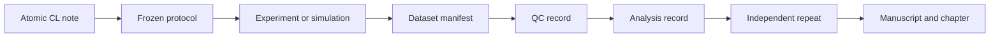

---
{"dg-publish":true,"permalink":"/ii-areas/03-thesis/claim-ledger/claim-ledger-and-evidence-matrix/","title":"Claim Ledger & Evidence Matrix","tags":["topic/ltsg/breakdown","topic/ltsg/statistics","topic/ltsg/model"],"dgHomeLink":true,"noteIcon":"","created":"2026-09-01","updated":"2026-09-07","dg-note-properties":{"title":"Claim Ledger & Evidence Matrix","aliases":["Claim Ledger","Evidence Matrix"],"type":"moc","status":"active","context":"thesis","topics":["topic/ltsg/breakdown","topic/ltsg/statistics","topic/ltsg/model"],"tags":["topic/ltsg/breakdown","topic/ltsg/statistics","topic/ltsg/model"],"date":"2026-09-01","last_updated":"2026-09-07"}}
---

# Claim Ledger & Evidence Matrix

This is the dashboard for all scientific claims permitted in the dissertation. The stable CL identifiers are now represented by atomic notes so that datasets, analyses, manuscripts and chapters can link to them through properties.

## Document authority

Use [[II Areas/03_Thesis/LaTeX_Thesis/Doctoral Document Map\|Doctoral Document Map]] for the document hierarchy. Atomic CL-01 through CL-06 are authoritative; the earlier LaTeX C-01 through C-16 register is historical and is not an interchangeable numbering scheme.

## Contribution architecture

| Contribution | Claims | Role | Completion condition |
| --- | --- | --- | --- |
| **C-A — Reproducible operating window** | [[II Areas/03_Thesis/Claims/CL-01 - Laser-assisted breakdown probability\|CL-01 - Laser-assisted breakdown probability]], [[II Areas/03_Thesis/Claims/CL-02 - Delay and jitter response\|CL-02 - Delay and jitter response]] | Primary | Confirmatory effect or quantitative bound with independent repeat |
| **C-B — Channel state and mechanism** | [[II Areas/03_Thesis/Claims/CL-03 - Channel state versus pulse energy\|CL-03 - Channel state versus pulse energy]], [[II Areas/03_Thesis/Claims/CL-06 - Reproducible optical and electrical stages\|CL-06 - Reproducible optical and electrical stages]] | Primary | Held-out channel-informed comparison and defensible timing interpretation |
| **C-C — Predictive reduced model** | [[II Areas/03_Thesis/Claims/CL-05 - Reduced predictive model\|CL-05 - Reduced predictive model]] | Primary | One untouched core outcome predicted within predeclared tolerance |
| Supporting robustness | [[II Areas/03_Thesis/Claims/CL-04 - Polarity and field geometry\|CL-04 - Polarity and field geometry]] | Supporting | Interaction estimate or quantitative bound if activated |

The minimum defensible dissertation requires C-A, C-B and C-C to be tested, not necessarily confirmed. CL-04 may remain bounded. Optional extension claims may not replace a missing core contribution.

## Claim dashboard

| Claim                                                                                                                                   | Contribution          | Role       | State      | WP                                            | Datasets  | Output                    |
| --------------------------------------------------------------------------------------------------------------------------------------- | --------------------- | ---------- | ---------- | --------------------------------------------- | --------- | ------------------------- |
| [[II Areas/03_Thesis/Claims/CL-01 - Laser-assisted breakdown probability\|CL-01 - Laser-assisted breakdown probability]]             | C-A                   | primary    | hypothesis | <ul><li>WP1</li><li>WP3</li><li>WP4</li></ul> | <ul></ul> | <ul><li>Paper-1</li></ul> |
| [[II Areas/03_Thesis/Claims/CL-02 - Delay and jitter response\|CL-02 - Delay and jitter response]]                                   | C-A                   | primary    | hypothesis | <ul><li>WP0</li><li>WP3</li><li>WP4</li></ul> | <ul></ul> | <ul><li>Paper-1</li></ul> |
| [[II Areas/03_Thesis/Claims/CL-03 - Channel state versus pulse energy\|CL-03 - Channel state versus pulse energy]]                   | C-B                   | primary    | hypothesis | <ul><li>WP2</li><li>WP3</li><li>WP4</li></ul> | <ul></ul> | <ul><li>Paper-1</li></ul> |
| [[II Areas/03_Thesis/Claims/CL-04 - Polarity and field geometry\|CL-04 - Polarity and field geometry]]                               | Supporting robustness | supporting | hypothesis | <ul><li>WP1</li><li>WP4</li></ul>             | <ul></ul> | <ul></ul>                 |
| [[II Areas/03_Thesis/Claims/CL-05 - Reduced predictive model\|CL-05 - Reduced predictive model]]                                     | C-C                   | primary    | hypothesis | <ul><li>WP2</li><li>WP5</li></ul>             | <ul></ul> | <ul><li>Paper-2</li></ul> |
| [[II Areas/03_Thesis/Claims/CL-06 - Reproducible optical and electrical stages\|CL-06 - Reproducible optical and electrical stages]] | C-B                   | primary    | hypothesis | <ul><li>WP0</li><li>WP2</li><li>WP4</li></ul> | <ul></ul> | <ul><li>Paper-2</li></ul> |

{ .block-language-dataview}
## Evidence linked to claims

| Evidence | Type | Evidence state | Claims | Dataset | Updated |
| -------- | ---- | -------------- | ------ | ------- | ------- |

{ .block-language-dataview}
## Evidence-state vocabulary

| State | Meaning |
| --- | --- |
| `planned` | No frozen protocol or primary evidence yet |
| `protocol-frozen` | Outcomes, contrasts, exclusions and stopping rules fixed |
| `collected` | Raw data and manifest exist, QC not complete |
| `qc-passed` | Integrity and measurement checks passed |
| `analysed` | Predeclared analysis executed on a frozen dataset |
| `replicated` | Main result repeated independently |
| `published` | Traceable result accepted or published |

## Rules for deciding claims

1. Define the smallest practically relevant effect or prediction tolerance before confirmatory analysis.
2. Preserve failed shots and negative findings.
3. Distinguish source timing, diagnostic uncertainty and discharge variability.
4. Do not use statistical significance as the sole acceptance criterion.
5. A claim is not supported until it has QC-passed primary evidence, uncertainty and an independent repeat.
6. If evidence cannot support the positive claim, record a quantitative bound and use `falsified-bounded`.
7. Every result figure must identify its dataset freeze and analysis version.

## Required evidence route

## Core-to-output matrix

| Claim | Protocol/WP | Primary evidence | Planned output | Chapter |
| --- | --- | --- | --- | --- |
| CL-01 | WP1, WP3, WP4 | Matched laser/no-laser probability | Paper 1 | Chapter 4 |
| CL-02 | WP0, WP3, WP4 | Censored delay and jitter distributions | Paper 1 | Chapter 4 |
| CL-03 | WP2-WP4 | Energy-only versus channel-informed held-out model | Paper 1 | Chapter 4 |
| CL-04 | WP1, WP4 | Normalised polarity/geometry interaction | Optional Paper 2 | Chapter 4 or limitations |
| CL-05 | WP5 | Calibration/validation model package | Paper 2 | Chapters 3 and 5 |
| CL-06 | WP0, WP2, WP4 | Synchronized optical/electrical timing | Paper 2 | Chapter 4 |

## Extension claims — inactive by default

| ID | Extension | Activation gate | Status |
| --- | --- | --- | --- |
| **EX-EMP-01** | EMP difference beyond stored energy and timing | Stable core + calibrated RF chain + pickup controls | Planned |
| **EX-RAD-01** | Photon/electron emission probability or spatial distribution | Radiation approval + passive survey + EMP controls | Planned |
| **EX-RAD-02** | Neutron component under specified configuration | Plausible mechanism + multi-response calibration + approval | Planned |
| **EX-APP-01** | System-level advantage in a named pulsed-power demonstrator | Core reliability, recovery and lifetime data | Planned |
| **EX-ECO-01** | Favourable reliability/cost envelope | Demonstrator evidence + defensible cost distributions | Planned |

Extension results are included only if their activation gate is passed without delaying the core thesis.

## Literature constraints

| Evidence | Supports | Does not establish on this apparatus |
| --- | --- | --- |
| Luther et al. 2001, [doi:10.1063/1.1419036](https://doi.org/10.1063/1.1419036) | Very low jitter is possible in an optimised small pressurised gap | Performance of the present atmospheric system |
| Arantchouk et al. 2013, [doi:10.1063/1.4802927](https://doi.org/10.1063/1.4802927) | Filament triggering can achieve high-current, low-jitter switching | Transfer to the present geometry and laser regime |
| Rosenthal et al. 2020, [doi:10.1364/OE.398836](https://doi.org/10.1364/OE.398836) | Heating and density-channel evolution can be central | Dominance under the present pulse duration and timing |
| [[III Resources/03_Literature/LN - Cikhardt2026 - Electromagnetic and Particle Pulses\|LN - Cikhardt2026 - Electromagnetic and Particle Pulses]] | EMP measurement and source-attribution discipline | Atmospheric LTSG EMP amplitude or particle yield |
| [[III Resources/03_Literature/LN - Stepanova2026 - Ionising Radiation from Impulse Generators\|LN - Stepanova2026 - Ionising Radiation from Impulse Generators]] | Passive diagnostics, spatial mapping and background controls | Radiation presence or mechanism in laser-triggered shots |

## Integrity note

Earlier unsupported values concerning delay reduction, model agreement, wear reduction and economic payback remain excluded. A numerical claim can be reintroduced only with a dataset identifier, analysis version, uncertainty and verification state.

## Stable compatibility anchors

These headings preserve existing block links. The atomic claim note is authoritative.

### CL-01

See [[II Areas/03_Thesis/Claims/CL-01 - Laser-assisted breakdown probability\|CL-01 - Laser-assisted breakdown probability]].

### CL-02

See [[II Areas/03_Thesis/Claims/CL-02 - Delay and jitter response\|CL-02 - Delay and jitter response]].

### CL-03

See [[II Areas/03_Thesis/Claims/CL-03 - Channel state versus pulse energy\|CL-03 - Channel state versus pulse energy]].

### CL-04

See [[II Areas/03_Thesis/Claims/CL-04 - Polarity and field geometry\|CL-04 - Polarity and field geometry]].

### CL-05

See [[II Areas/03_Thesis/Claims/CL-05 - Reduced predictive model\|CL-05 - Reduced predictive model]].

### CL-06

See [[II Areas/03_Thesis/Claims/CL-06 - Reproducible optical and electrical stages\|CL-06 - Reproducible optical and electrical stages]].

### EX-EMP-01

Inactive EMP extension; activate only after the calibrated-RF-chain gate.

### EX-RAD-01

Inactive photon/electron radiation extension; begin with an approved passive survey.

### EX-RAD-02

Inactive neutron extension requiring mechanism, multi-response calibration and approval.

### EX-APP-01

Inactive named pulsed-power demonstrator extension.

### EX-ECO-01

Inactive reliability/economic feasibility extension based only on measured inputs.

## Operating review

Review this ledger weekly during acquisition and at every supervisor meeting. The atomic CL note is the authoritative statement; this dashboard shows relationships and current scope.

## Related notes

- [[I Projects/03_Milestones/20260925 Minimum/Minimum Dissertation Study & Research Discussion 2026\|Minimum Dissertation Study & Research Discussion 2026]]
- [[I Projects/02_Campaigns/LTSG Core Research Package 2026-2028\|LTSG Core Research Package 2026-2028]]
- [[II Areas/03_Thesis/LaTeX_Thesis/Thesis Structure & Chapter Outline\|Thesis Structure & Chapter Outline]]
- [[_System/Research Methodology & Workflows\|Research Methodology & Workflows]]
- [[I Projects/01_Manuscripts/Paper - IEEE Transactions 2026\|Paper - IEEE Transactions 2026]]
