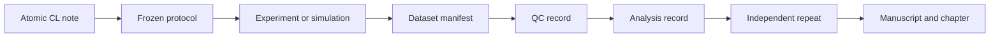

---
{"dg-publish":true,"permalink":"/ii-areas/03-thesis/claim-ledger/claim-ledger-and-evidence-matrix/","title":"Claim Ledger & Evidence Matrix","tags":["topic/ltsg/breakdown","topic/ltsg/statistics","topic/ltsg/model"],"dgHomeLink":true,"noteIcon":"","created":"2026-09-01","updated":"2026-09-14","dg-note-properties":{"title":"Claim Ledger & Evidence Matrix","aliases":["Claim Ledger","Evidence Matrix"],"type":"moc","status":"active","context":"thesis","topics":["topic/ltsg/breakdown","topic/ltsg/statistics","topic/ltsg/model"],"tags":["topic/ltsg/breakdown","topic/ltsg/statistics","topic/ltsg/model"],"date":"2026-09-01","last_updated":"2026-09-14"}}
---


# Claim Ledger & Evidence Matrix

The long-term goal of programme W is to contribute to technically and economically viable high-voltage equipment without SF₆. The selected dissertation is **Tier 1: atmospheric-air metrology, stochastic prediction and mandatory bounded TCO**, with **submission targeted for August 2028**. Tier 2 (CO₂/pressure transfer) and Tier 3 (applications) are separately resourced follow-on research, outside mandatory completion and its publication requirements. Full replacement of SF₆ is the programme's direction, not a demonstrated result or a dissertation completion condition.

Working authority: [[I Projects/03_Milestones/20260925 Minimum/Doctoral Progress Review and Research Plan for Professional Discussion 2026\|Doctoral Progress Review & Dissertation Plan (2024–2028)]], revised 14 September 2026. This records the candidate's planning choice; formal supervisor, committee and ISP/KOS approval remains separately evidenced.

This is the dashboard for all scientific claims permitted in the dissertation. The stable CL identifiers are now represented by atomic notes so that datasets, analyses, manuscripts and chapters can link to them through properties.

## Document authority

Use [[II Areas/03_Thesis/LaTeX_Thesis/Doctoral Document Map\|Doctoral Document Map]] for the document hierarchy. The reviewer report governs current scope; stable atomic CL-01 through CL-07 define the tests. C-W1/C-W2/C-WE/C-W5 are contribution groups, not a competing claim-number sequence. Earlier C-A/C-B/C-C and LaTeX C-01–C-16 are historical mappings. C-W3/C-W4 are follow-on only.

## Contribution architecture

| Contribution | Evidence and role |
| --- | --- |
| C-W1 | Reproducible atmospheric operating domain; probability and calibrated timing; CL-01, CL-02 and supporting CL-06 |
| C-W2 | Independent comparison of M0 and channel-informed M1; CL-03 and CL-05 |
| C-WE | Mandatory bounded TCO and technically feasible operating choice; CL-07 |
| C-W5 | Traceable data, calibrations, analysis, uncertainty and reproducibility across all claims |

CL-04 is supporting robustness within the frozen atmospheric configuration family. C-W3/C-W4 belong only to follow-on Tier 2. A null result must be accompanied by adequate sensitivity and a quantitative limit; it does not automatically guarantee degree sufficiency.

## Claim dashboard

```dataview
TABLE WITHOUT ID
    file.link AS "Claim",
    contribution AS "Contribution",
    claim_role AS "Role",
    status AS "State",
    work_packages AS "WP",
    datasets AS "Datasets",
    manuscripts AS "Output"
FROM "II Areas/03_Thesis/Claims"
WHERE row["dg-publish"] = true
SORT claim_id ASC
```
## Evidence linked to claims

```dataview
TABLE WITHOUT ID
    file.link AS "Evidence",
    type AS "Type",
    evidence_state AS "Evidence state",
    claims AS "Claims",
    dataset_id AS "Dataset",
    last_updated AS "Updated"
FROM "II Areas/01_Research/Experiments"
WHERE length(claims) > 0 AND row["dg-publish"] = true
SORT last_updated DESC
```
## Evidence-state vocabulary

| State | Meaning |
| --- | --- |
| `planned` | No frozen protocol or primary evidence yet |
| `protocol-frozen` | Outcomes, contrasts, exclusions and stopping rules fixed |
| `collected` | Raw data and manifest exist, QC not complete |
| `qc-passed` | Integrity and measurement checks passed |
| `analysed` | Predeclared analysis executed on a frozen dataset |
| `replicated` | Main result repeated independently |
| `published` | Traceable result accepted or published |

## Rules for deciding claims

1. Define the smallest practically relevant effect or prediction tolerance before confirmatory analysis.
2. Preserve failed shots and negative findings.
3. Distinguish source timing, diagnostic uncertainty and discharge variability.
4. Do not use statistical significance as the sole acceptance criterion.
5. A claim is not supported until it has QC-passed primary evidence, uncertainty and an independent repeat.
6. If evidence cannot support the positive claim, record a quantitative bound and use `falsified-bounded`.
7. Every result figure must identify its dataset freeze and analysis version.

## Required evidence route



## Core-to-output matrix

| Claim | WP | Evidence | Output | Chapter |
| --- | --- | --- | --- | --- |
| CL-01 | WP1, WP3, WP4 | Atmospheric probability and independent repeat | Paper 1 | 4 |
| CL-02 | WP0, WP3, WP4 | Calibrated delay distributions without assumed monotonicity | Paper 1 | 4 |
| CL-03 | WP2–WP5 | Independent M0/M1 comparison | Paper 2 | 5 |
| CL-04 | WP1, WP4 if activated | Supporting geometry/polarity robustness | Supporting only | 4 |
| CL-05 | WP5 | Reduced prediction with held-out validation | Paper 2 | 5 |
| CL-06 | WP0, WP2, WP4 | Observable optical/electrical timing and limits | Supporting Paper 1 | 4 |
| CL-07 | Cost collection from WP0; WP6 synthesis | Feasible operating choice, TCO and uncertainty | Paper 2 | 6 |

C-W5 spans all rows. Planned evidence is not a completed result.

## Extension claims — inactive by default

| ID | Extension | Activation gate | Status |
| --- | --- | --- | --- |
| **EX-EMP-01** | EMP difference beyond stored energy and timing | Stable core + calibrated RF chain + pickup controls | Planned |
| **EX-RAD-01** | Photon/electron emission probability or spatial distribution | Radiation approval + passive survey + EMP controls | Planned |
| **EX-RAD-02** | Neutron component under specified configuration | Plausible mechanism + multi-response calibration + approval | Planned |
| **EX-APP-01** | System-level advantage in a named pulsed-power demonstrator | Core reliability, recovery and lifetime data | Planned |
| **EX-ECO-01** | System-level reliability/cost envelope beyond the mandatory laboratory TCO | Demonstrator evidence + defensible cost distributions | Planned |

All extension rows are outside mandatory completion. They cannot replace C-WE or impose a dependency on August 2028 submission.

## Literature constraints

| Evidence | Supports | Does not establish on this apparatus |
| --- | --- | --- |
| Luther et al. 2001, [doi:10.1063/1.1419036](https://doi.org/10.1063/1.1419036) | Very low jitter is possible in an optimised small pressurised gap | Performance of the present atmospheric system |
| Arantchouk et al. 2013, [doi:10.1063/1.4802927](https://doi.org/10.1063/1.4802927) | Filament triggering can achieve high-current, low-jitter switching | Transfer to the present geometry and laser regime |
| Rosenthal et al. 2020, [doi:10.1364/OE.398836](https://doi.org/10.1364/OE.398836) | Heating and density-channel evolution can be central | Dominance under the present pulse duration and timing |
| [[LN - Cikhardt2026 - Electromagnetic and Particle Pulses]] | EMP measurement and source-attribution discipline | Atmospheric LTSG EMP amplitude or particle yield |
| [[LN - Stepanova2026 - Ionising Radiation from Impulse Generators]] | Passive diagnostics, spatial mapping and background controls | Radiation presence or mechanism in laser-triggered shots |

## Integrity note

Earlier unsupported values concerning delay reduction, model agreement, wear reduction and economic payback remain excluded. A numerical claim can be reintroduced only with a dataset identifier, analysis version, uncertainty and verification state.

## Stable compatibility anchors

These headings preserve existing block links. The atomic claim note is authoritative.

### CL-01

See [[CL-01 - Laser-assisted breakdown probability]].

### CL-02

See [[CL-02 - Delay and jitter response]].

### CL-03

See [[CL-03 - Channel state versus pulse energy]].

### CL-04

See [[CL-04 - Polarity and field geometry]].

### CL-05

See [[CL-05 - Reduced predictive model]].

### CL-06

See [[CL-06 - Reproducible optical and electrical stages]].

### EX-EMP-01

Inactive EMP extension; activate only after the calibrated-RF-chain gate.

### EX-RAD-01

Inactive photon/electron radiation extension; begin with an approved passive survey.

### EX-RAD-02

Inactive neutron extension requiring mechanism, multi-response calibration and approval.

### EX-APP-01

Inactive named pulsed-power demonstrator extension.

### EX-ECO-01

Inactive system-level economic extension. Mandatory laboratory TCO is CL-07/C-WE and does not depend on EX-APP-01 or EX-ECO-01.

## Operating review

Review this ledger weekly during acquisition and at every supervisor meeting. The atomic CL note is the authoritative statement; this dashboard shows relationships and current scope.

## Related notes

- [[Minimum Dissertation Study & Research Discussion 2026]]
- [[LTSG Core Research Package 2026-2028]]
- [[Thesis Structure & Chapter Outline]]
- [[Research Methodology & Workflows]]
- [[Paper - IEEE Transactions 2026]]

## CL-07

[[CL-07 - Techno-economic operating choice]] — mandatory C-WE; Chapter 6 and Paper 2. State: hypothesis/planned evidence, not an established optimum.
