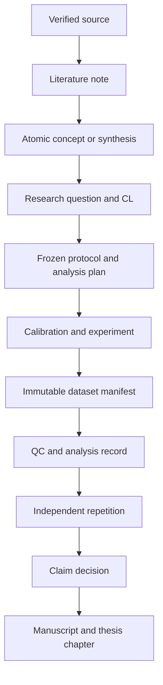

# Research Methodology & Workflows

This is the canonical operating manual for converting literature, models and laboratory work into defensible dissertation claims. The active scientific programme is [[LTSG Core Research Package 2026-2028]] and the immediate priority is [[Minimum Dissertation Study & Research Discussion 2026]].

## 1. Research spine

No arrow may be skipped for a principal dissertation claim.

## 2. Canonical research question

How does the measured time-dependent state of a laser-induced channel, rather than nominal pulse energy alone, determine breakdown probability, delay and jitter in an atmospheric-pressure high-voltage gap at a controlled working coefficient, and can a reduced model predict these outcomes under held-out conditions?

The three intended contributions are:

- **C-A — Reproducible operating window:** CL-01 and CL-02.
- **C-B — Channel state and mechanism:** CL-03 and CL-06.
- **C-C — Predictive reduced model:** CL-05.

CL-04 is a supporting robustness question. EMP, radiation, a pulsed-power demonstrator and techno-economics remain gated extensions.

## 3. Literature workflow

1. Verify bibliographic metadata and attach or locate the primary source.
2. Create one literature note containing methods, sample size, findings, assumptions and limits of transfer.
3. Extract an atomic concept only when it is written in the researcher's own words and linked to its sources.
4. Link the source to every CL it supports or constrains.
5. Never copy an external numerical result into a claim without its experimental conditions and uncertainty.

## 4. Protocol workflow

Before confirmatory data collection:

- assign a stable protocol ID and version;
- define primary and secondary outcomes;
- define the laser time origin, breakdown marker and trigger gate;
- predeclare failed-shot and censoring rules;
- define the practically relevant effect and uncertainty requirement;
- freeze factor ranges, randomisation, blocking and stopping rules;
- link the protocol to CL, calibration records and safety approval.

A post-freeze change creates a new protocol version and a decision record. Existing data retain the original protocol reference.

## 5. Experimental workflow

### Before a session

- verify safety, interlocks and equipment availability;
- confirm active protocol and calibration validity;
- allocate experiment and dataset IDs;
- record geometry, polarity, pressure, temperature, humidity and electrode history;
- run the four-state noise/pickup control where relevant.

### During a session

- generate an immutable shot ID for every commanded shot, including failures;
- preserve raw waveforms before filtering;
- record measured laser variables rather than nominal settings;
- flag saturation, missing channels and operator deviations immediately;
- do not delete failed or inconvenient shots.

### Within 24 hours

- complete the experiment note and dataset manifest;
- copy data to controlled storage and record checksum/version;
- run structural QC and create a QC report;
- record deviations without changing the protocol retroactively;
- update the linked project task, but do not promote the CL yet.

## 6. Analysis workflow

1. Freeze the dataset and record its identifier.
2. Execute the predeclared primary analysis first.
3. Treat non-breakdowns as censored outcomes where appropriate.
4. Report effect sizes, intervals and predictive calibration, not only p-values.
5. Separate exploratory plots from confirmatory results.
6. Link figures and tables to an analysis ID, code commit and dataset freeze.
7. Repeat the main result in another session or after an electrode-service boundary.

For model claims, keep calibration and validation conditions physically separated. Report prediction intervals and failure regions rather than only best-fit curves.

## 7. Claim promotion rules

| Claim state | Required evidence |
| --- | --- |
| Hypothesis | Testable statement, outcome and falsification rule |
| In progress | Frozen protocol and active evidence collection |
| Supported | QC-passed primary data, uncertainty criterion and independent repetition |
| Falsified/bounded | Null or contradictory result reported with a quantitative bound |
| Published | Claim appears in an accepted/published output with traceable evidence |

A literature-supported statement is not evidence that the same effect occurs on the present apparatus.

## 8. Writing and publication workflow

- Write methods while the protocol is being built.
- Create empty figure shells before confirmatory acquisition.
- Update the dissertation continuously; do not postpone Chapters 1-3 until the end.
- Every manuscript result links back to a CL and analysis record.
- Every thesis claim links forward to a manuscript or is explicitly identified as unpublished evidence.
- Journal selection follows the final contribution and audience; quartile and scope are rechecked at submission.

## 9. Operating cadence

### Daily

- identify one principal research outcome;
- record decisions and deviations in the daily note;
- process experiment metadata before leaving the session.

### Weekly — 45 minutes

- empty or defer Inbox items;
- update next actions and blockers for every active project;
- inspect evidence states and unresolved QC;
- write at least one dissertation subsection or figure narrative;
- check the next 30-day deadlines.

### Monthly — supervisor evidence review

- review the CL dashboard;
- approve or reject scope changes;
- review the publication critical path;
- record decisions in a supervisor meeting note;
- confirm laboratory access and administrative milestones.

### At every gate

- decide continue, redesign or narrow;
- preserve negative results;
- prevent optional extensions from delaying the core package.

## 10. Definition of done

The core evidence package is complete when:

- a reproducible self-breakdown baseline defines the working coefficient;
- laser/channel variables are measured with uncertainty;
- one compact confirmatory experiment is completed with censored outcomes retained;
- the principal result is independently repeated;
- the reduced model is evaluated on untouched conditions;
- CL-01, CL-02, CL-03, CL-05 and CL-06 are supported or quantitatively bounded;
- the evidence is incorporated into journal manuscripts and thesis Chapters 2-4.

## Related system notes

- [[PhD Vault Architecture Guide]]
- [[Tags and Linking Convention]]
- [[Digital Garden & Vercel Deployment Guide]]

