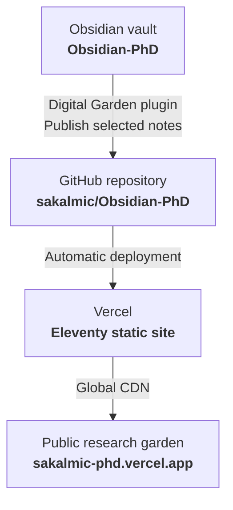

---
{"dg-publish":true,"permalink":"/system/digital-garden-and-vercel-deployment-guide/","tags":["type/guide","context/phd","theme/system"],"dgHomeLink":true,"noteIcon":"","created":"2026-09-01","updated":"2026-09-01","dg-note-properties":{"aliases":["Digital Garden & Vercel Deployment Guide","Digital Garden Setup"],"tags":["type/guide","context/phd","theme/system"],"date":"2026-09-01","last_updated":"2026-09-01"}}
---


# Digital Garden & Vercel Deployment Guide

This guide describes how selected notes from the **Obsidian-PhD** vault are published as a fast, responsive digital garden through GitHub and Vercel.

---

## Publication architecture



---

## One-time setup

1. Create or connect the GitHub repository used by the Digital Garden template.
2. Import that repository into Vercel and enable automatic deployments from the main branch.
3. In **Obsidian → Settings → Digital Garden**, configure the repository name, GitHub user, access token and garden base URL.
4. Test the connection before publishing notes.

> [!important]
> Store access tokens only in the local Digital Garden plugin configuration. Never commit them to the site repository or publish the configuration file.

---

## Publishing notes

Every public note must include the following frontmatter:

```yaml
---
dg-publish: true
dg-home-link: true
dg-show-backlinks: true
dg-show-local-graph: true
---
```

To publish changes:

1. Open the command palette in Obsidian.
2. Select **Digital Garden: Publication Center**.
3. Review new, changed and removed notes.
4. Select **Publish Changed Notes**.
5. Wait for the Vercel deployment to complete.

---

## Language and visual configuration

- Site language and interface strings are configured in the Digital Garden plugin and the site repository's `.env` file.
- The deployed visual theme is maintained in `src/site/styles/custom-style.scss`.
- Vault-only styling is maintained in `.obsidian/snippets/phd-styles.css`.
- Keep public navigation links restricted to notes with `dg-publish: true` to avoid unresolved links and 404 pages.

---

## Privacy checklist

- Publish only notes explicitly marked `dg-publish: true`.
- Keep meeting minutes, budgets, student records, internal administration and unpublished datasets private.
- Review Dataview results before publication; a public dashboard must not reveal titles or metadata from private notes.
- Rotate an access token immediately if it is ever exposed outside the local plugin configuration.
