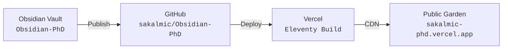

---
aliases:
  - Digital Garden & Vercel Deployment Guide
  - Digital Garden Setup
tags:
  - type/guide
  - context/phd
  - theme/system
date: 2026-09-01
last_updated: 2026-09-01
dg-publish: true
dg-home-link: true
---

# Digital Garden & Vercel Deployment Guide

This guide describes how selected notes from the **Obsidian-PhD** vault are published as a fast, responsive digital garden through GitHub and Vercel.

---

## Publication architecture

> [!note] Alternativní varianty zobrazení publikační architektury
> Níže jsou připraveny 4 alternativní varianty zobrazení publikačního řetězce (od strukturovaného procesního pipeline s přímými odkazy do Obsidianu a na externí služby až po kompaktní grafiku). Po otestování na desktopu i mobilu si vyberte preferovanou variantu a ostatní smažte.

### Alternativa 1: Strukturovaný procesní pipeline s odkazy (Doporučeno)

1. **[[_System/PhD Vault Architecture Guide|Obsidian Vault (Obsidian-PhD)]]** — lokální znalostní trezor; publikují se pouze vybrané poznámky s hlavičkou `dg-publish: true`.
2. **[[_System/Digital Garden & Vercel Deployment Guide#Publishing notes|Digital Garden Plugin]]** — interní plugin Obsidianu přenášející změněné poznámky přes GitHub API.
3. **[GitHub Repository (sakalmic/Obsidian-PhD)](https://github.com/sakalmic/Obsidian-PhD)** — centrální verzovaný repozitář se zdrojovými texty poznámek a šablonou Eleventy.
4. **[Vercel CI/CD Build](https://vercel.com)** — automatický build runner spouštějící statický generátor Eleventy (`npm run build`).
5. **[Veřejný Digital Garden (sakalmic-phd.vercel.app)](https://sakalmic-phd.vercel.app)** — výsledná statická publikace distribuovaná po globální síti Vercel Edge CDN.

---

### Alternativa 2: Kompaktní inline řetězec (Breadcrumb Flow)

`[[_System/PhD Vault Architecture Guide|Obsidian-PhD (Vault)]]` → *`Digital Garden plugin`* → **[GitHub Repo](https://github.com/sakalmic/Obsidian-PhD)** → *`Auto Build`* → **[Vercel (Eleventy)](https://vercel.com)** → *`Global CDN`* → **[sakalmic-phd.vercel.app](https://sakalmic-phd.vercel.app)**

---

### Alternativa 3: Přehledná tabulka architektury

| Vrstva | Komponenta | Funkce a role | Odkaz / Konfigurace |
| :---: | :--- | :--- | :--- |
| **01** | **Obsidian trezor** | Editace poznámek, správa claimů a literatury | [[_System/PhD Vault Architecture Guide\|Architektura trezoru]] |
| **02** | **Digital Garden Plugin** | Filtrování poznámek s `dg-publish: true` a push | [[_System/Digital Garden & Vercel Deployment Guide#Publishing notes\|Postup publikace]] |
| **03** | **GitHub repozitář** | Verzování zdrojových textů a Eleventy šablon | [sakalmic/Obsidian-PhD](https://github.com/sakalmic/Obsidian-PhD) |
| **04** | **Vercel Build Engine** | Statická kompilace SASS a HTML přes 11ty | [[_System/Digital Garden & Vercel Deployment Guide#Language and visual configuration\|Konfigurace buildu]] |
| **05** | **Veřejný web** | Globálně dostupná prezentace výzkumu na CDN | [sakalmic-phd.vercel.app](https://sakalmic-phd.vercel.app) |

---

### Alternativa 4: Kompaktní responzivní Mermaid diagram



---

## One-time setup

1. Create or connect the GitHub repository used by the Digital Garden template.
2. Import that repository into Vercel and enable automatic deployments from the main branch.
3. In **Obsidian → Settings → Digital Garden**, configure the repository name, GitHub user, access token and garden base URL.
4. Test the connection before publishing notes.

> [!important]
> Store access tokens only in the local Digital Garden plugin configuration. Never commit them to the site repository or publish the configuration file.

---

## Publishing notes

Every public note must include the following frontmatter:

```yaml
---
dg-publish: true
dg-home-link: true
dg-show-backlinks: true
dg-show-local-graph: true
---
```

To publish changes:

1. Open the command palette in Obsidian.
2. Select **Digital Garden: Publication Center**.
3. Review new, changed and removed notes.
4. Select **Publish Changed Notes**.
5. Wait for the Vercel deployment to complete.

---

## Language and visual configuration

- Site language and interface strings are configured in the Digital Garden plugin and the site repository's `.env` file.
- The deployed visual theme is maintained in `src/site/styles/custom-style.scss`.
- Vault-only styling is maintained in `.obsidian/snippets/phd-styles.css`.
- Keep public navigation links restricted to notes with `dg-publish: true` to avoid unresolved links and 404 pages.

---

## Privacy checklist

- Publish only notes explicitly marked `dg-publish: true`.
- Keep meeting minutes, budgets, student records, internal administration and unpublished datasets private.
- Review Dataview results before publication; a public dashboard must not reveal titles or metadata from private notes.
- Rotate an access token immediately if it is ever exposed outside the local plugin configuration.
